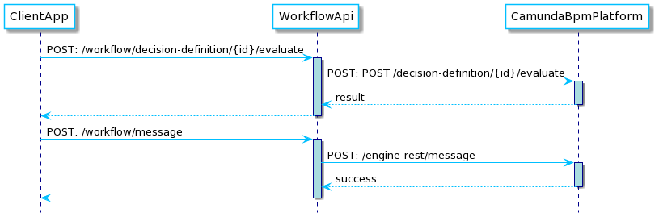

# wa-workflow-api

[](https://github.com/hmcts/wa-workflow-api)

[](https://opensource.org/licenses/MIT)

Last reviewed on: **18/04/2025**

#### What does this app do?

Provides endpoints to:

- Evaluate DMN configuration deployed in Camunda
- Correlate messages to Camunda that will either initiate or cancel Camunda BPMN processes

<!--
    Sequence Diagram Source:
    http://www.plantuml.com/plantuml/uml/dP71Qjn038RFgwSOw7dnkJc4U7Sf509TIA1dnIDxXSSZLwE96qBUlKDJdDaKjYKws8D-wTClT9CCrV8KuCIUN2zY3_8J88qSPrISN3gXbuNZu4mpdIdq8rFio3t3fbMLPIz1r1s8vhlnQHSobNndeZjHJ_ggUjJnuRTqoptTSgH_gDYDWqgE_hNYK_lvi3zyWGriZgZ67SyOhMRKy-kQzwJbn4Rm0e3P13lZHpHo4c5-wt7xm1IjdUUpx7VHiG-oj3EVL-DKyBYRfsD0wqKdW7ksG6k7QuzV0LQgsrxNC7VbZj_kxgzSi_n9DfuwJYnnwwddo5QUpKXFpNFvl3JqY26Z4K1DAT2_dRonAGuSQQkKx7_nheIIPOtbbtAmz6vY6RakLUstlRwytKGfuV1X-sj_vI_bhgDqqPyhuMazUNtD6ue-J-4N
    See: https://plantuml.com/ docs for reference
-->




## Notes

Since Spring Boot 2.1 bean overriding is disabled. If you want to enable it you will need to set `spring.main.allow-bean-definition-overriding` to `true`.

JUnit 5 is now enabled by default in the project. Please refrain from using JUnit4 and use the next generation

## Building and deploying the application

### Building the application

The project uses [Gradle](https://gradle.org) as a build tool. It already contains
`./gradlew` wrapper script, so there's no need to install gradle.

To build the project execute the following command:

```bash
  ./gradlew build
```

### Running the application

- Prerequisite:
    - Check if all services are running in minikube, if not follow the README in
    https://github.com/hmcts/wa-kube-environment
    - Check if Idam simulator is set as environment variable.
        ```
        echo $OPEN_ID_IDAM_URL
        ```
        You should see http://sidam-simulator/ as output.
        If you do not see, then from your wa-kube-enviroment map environment variables
        ```
        source .env
        ```
- You can either run as Java Application from run configurations or
    ```bash
      ./gradlew clean bootRun
    ```
- In order to test if the application is up, you can call its health endpoint:

    ```bash
      curl http://localhost:8099/health
    ```

    You should get a response similar to this:

    ```
      {"status":"UP","diskSpace":{"status":"UP","total":249644974080,"free":137188298752,"threshold":10485760}}
    ```

- To run all functional tests or single test you can run as Junit, make sure the env is set
    ```
        OPEN_ID_IDAM_URL=http://sidam-simulator/'
    ```
  Note: Make sure the BPMN and DMN are deployed onto Camunda locally.

 - To run all tests including junit, integration and functional. You can run the command
    ```
        ./gradlew test integration functional
    ```
   or
       ```
        ./gradlew tests
       ```

### Running contract or pact tests:

You can run contract or pact tests as follows:

```
./gradlew contract
```

You can then publish your pact tests locally by first running the pact docker-compose:

```
docker-compose -f docker-pactbroker-compose.yml up

```

and then using it to publish your tests:

```
./gradlew pactPublish
```

### PR Management

We use renovate to maintain dependencies via the renovate.json file.
See the renovate documentation: https://docs.renovatebot.com/configuration-options/
Renovate schedule syntax using Later can be validated here: https://codepen.io/rationaltiger24/full/ZExQEgK

We use stalebot to clear old PRs away using the github action.  Docs: https://github.com/actions/stale

